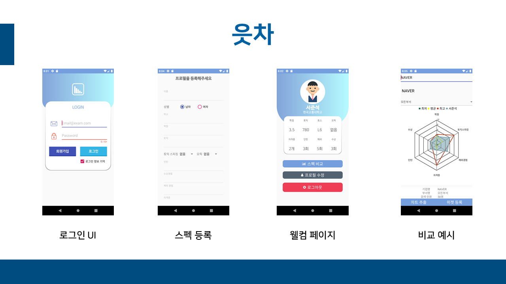
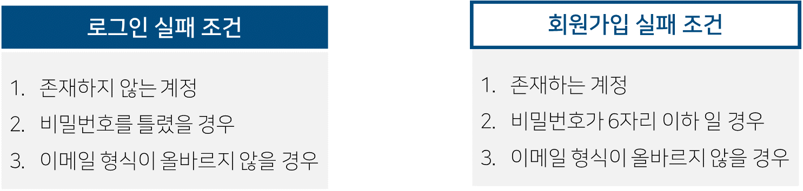
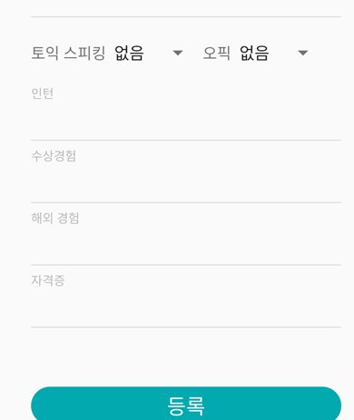
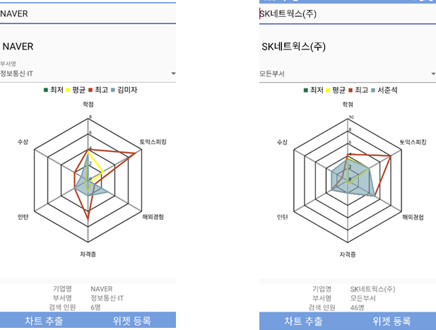
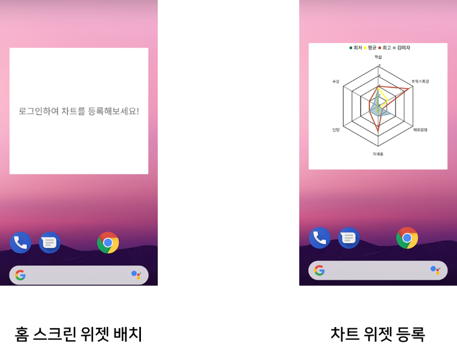

# 읏차
1. 개발동기와 주제
 * 취업을 준비하는 사람이라면 누구나 잡코리아, 사람인 등과 같은 취업관련사이트를 이용해본적이 있을것이다. 하지만 온라인 구인구직 플랫폼 서비스가 커지면서 내가 원하지 않는 정보가 많이 보이거나, 관심 없는 기업에서 연락이 오는 등  불필요한 서비스가 많이 생겨났다. 그러함에 있어서 원하는 데이터만 따로 빼내어 간소화된 서비스를 만들어보면 어떨까 하는 생각을 가지게 되었다.
2. 소프트웨어 환경
    * 어플리케이션 개발
      * 자바
      * 안드로이드 스튜디오
      * 파이어베이스
    * 데이터 스크래핑
      * 파이썬3
      * 파이참
3. 기능
    * 회원 계정
      * 사용자의 스펙이라는 것이 존재하기 때문에 로그인이라는 기능이 필수적으로 요구되어 Firebase의 이메일 인증 관련 클래스를 이용한 계정인증을 구현함.
      *  로그인과 회원가입의 실패 조건을 나누어 실패에 따라 사용자에게 어떤 실패조건인지 명시되도록 구현.
      *  사용자가 로그인에 성공 시, 사용자의 프로필 존재 여부를 판단. 만약 userData라는 컬렉션에 사용자의 프로필이 존재하지 않는다면, 사용자를 프로필 등록 액티비티로 강제로 넘김. 사용자가 프로필을 등록하면서 대부분 EditText를 사용하여 입력하지만, 토스와 오픽처럼 레벨이 정해져 있는 스펙에 대해서는 Spinner를 통하여 입력하도록 구현.
    * 그래프 표현
      *  합격자들의 취업한 기업과 부서가 각자 다르기때문에 사용자가 원하는 기업을 선택 할 시에 기업명에 사용자가 선택한 기업의 이름이 출력. 그 다음 기업마다 부서가 다르기 때문에 이또한 출력되도록 한 후, 차트 시각화 제공.
    * 위젯 등록
      *  위젯이 배경화면에 배치되어 있는 상태에서 위젯 등록 버튼을 누르게 되면 사용자에게 보여지는 차트가 위젯에 비트맵 이미지로 등록됨. 사용자는 위젯을 통해서 초기 설정후에는 자신이 원하는 기업이 바뀌거나 자신의 스펙이 바뀔 때만 어플리케이션을 실행하여 위젯을 재등록 하는 과정이 가능.